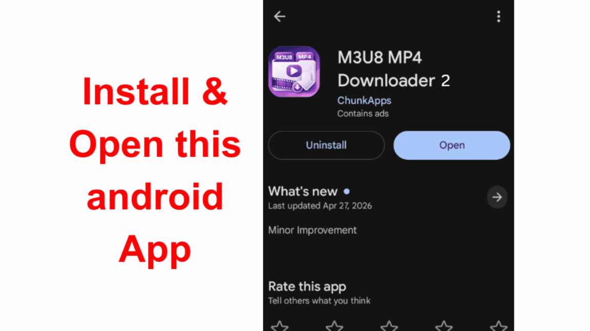

# How to Download videos from JavGuru?

Looking for information about the **JavGuru downloader**? In this tutorial, you will learn how to **download videos from JavGuru** using available options step by step. Follow along to understand the process, troubleshoot common issues, and get started quickly.

Let’s understand first that *JavGuru uses HLS* (HTTP Live Streaming) for video streaming.

HLS delivers video and audio over HTTP by splitting media into small segments and providing a playlist (.m3u8) that tells the player which segments to download.

## Download JavGuru videos on “Android” devices

Downloading JavGuru videos on android is very easy. There are various apps in google playstore that you can use to *save JavGuru videos offline* in your device.

I have found an app that is the best and easy to use, and that is “[M3U8 MP4 Downloader 2](https://play.google.com/store/apps/details?id=dev.pages.m3u8mp4downloader2)”.

## App demo for downloading JavGuru videos

<p align="center">
  
</p>

<p align="center">
  <a href="https://play.google.com/store/apps/details?id=dev.pages.m3u8mp4downloader2">
    
  </a>
</p>

## Is this app safe?

This app is available on the Google Play Store, so it is 100% safe. Also, this is not a “JavGuru downloader”; rather, it is a tool that can download HLS streams and convert them into MP4 format.

## How to use this app to download videos?

1. Open the app
2. Go to Find M3u8
3. Enter JavGuru video URL
4. Play the video
5. Click on Download button (it opens the list of hls streams)
6. Open Master Dropdowns and click on the resolution to download the video

---

### “Windows” Users (Manual Method)

It requires FFmpeg to be installed and available in your system PATH

Step 1 — Find the HLS Stream

Open your browser.

Press **F12** → **Network**

Reload the page.

Search for requests ending with:

```text
.m3u8
```

Copy the playlist URL.

---

Step 2 — Download Using FFmpeg

```bash
ffmpeg -i "https://example.com/master.m3u8" -c copy output.mp4
```

If stream copy isn't possible:

```bash
ffmpeg -i "https://example.com/master.m3u8" output.mp4
```

FFmpeg downloads every segment and merges them into a playable MP4.
